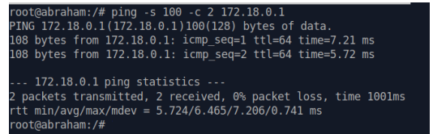
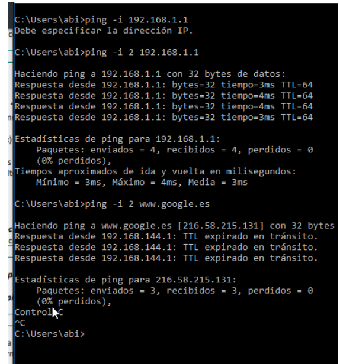
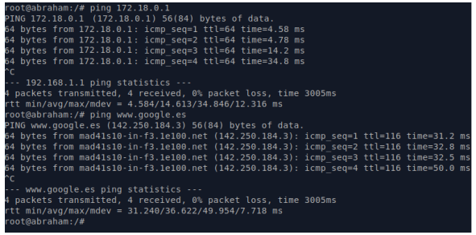
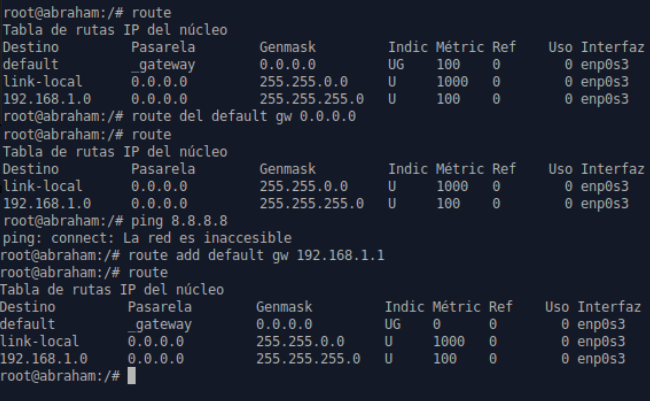
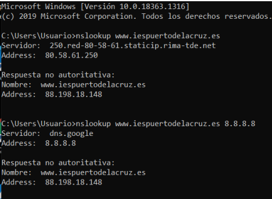

# UT5-A1 Comandos de Red

***Nombre:*** Abraham Sommerkamp González
***Curso:*** 1º de Ciclo Superior de Administración de Sistemas Informáticos en Red.

### ÍNDICE

+ [Introducción](#id1)
+ [Objetivos](#id2)
+ [Material empleado](#id3)
+ [Desarrollo](#id4)
+ [Conclusiones](#id5)

#### ***Introducción***. 

 Los comandos de red sirven para comprobar el estado de una Red y su funcionamiento para hacer pruebas. 

#### ***Objetivos***. 

Aquí vamos a probar los distintos comandos de red importantes en los Sistemas Operativos de Windows y Linux mas usados.

#### ***Material empleado***. 

Vamos a usar una maquina virtual de Windows y otra de Linux conectadas por modo puente.

#### ***Desarrollo***. 
<h3>

**Windows**

| Sintaxis                      |       Descripcion         |
| ----------------------------- | ------------------------- |
| Direccion IPv4                |       192.168.1.150      |
| Mascara                       |       255.255.255.0         |
| Gateway                       |       192.168.1.1          |
| MAC                           |      08:00:27:84:c7:6e    |
| Fabricante                    | Intel Pro/1000 MT Desktop |
| Servidores DNS                |            Ninguno        |
| Dirección IPv6                |fe80::11e:f943:dd3c:101b%2 |
| Tiempo de concesión de la IP  |         4 Segundos        |
| Nombre del adaptador de red   |         Ethernet:Red      |

**Linux**

| Sintaxis                      |       Descripcion         |
| ----------------------------- | ------------------------- |
| Direccion IPv4                |       172.18.99.254       |
| Mascara                       |       255.255.0.0         |
| Gateway                       |       172.18.0.1          |
| MAC                           |      08:00:27:0d:e9:97    |
| Fabricante                    | Intel Pro/1000 MT Desktop |
| Direccion IPv6                | fe80::e672:5713:dd04:71e1 |
| Servidores DNS                |          8.8.8.8          |
| Tiempo de concesión de la IP  |         4 Segundos        |
| Nombre del adaptador de red   |         enp0s3            |
</h3>

**Windows Ejercicios**

Ejercicio 1: 
Liberar la configuración IP del adaptador con ipconfig /release y a continuación volver a usar el comando ipconfig.
¿Cuál es la ip ahora? No hay IP se borra y despues se pone el dhcp. 

Ejercicio 2: ipconfig /renew
~~~console 
C:\Users\abi>ipconfig /release

Configuración IP de Windows

Adaptador de Ethernet Ethernet:

Sufijo DNS especifico para la conexidn. . :
Vinculo: direccién IPv6 local. . . : fe80::11e:f943:dd3c:101b%2
Puerta de enlace predeterminada. . . . . :
  

Adaptador de tunel Conexión de área local* 2:

Sufijo DNS especifico para la conexión. . :
Vinculo: direcci6n IPv6 local. . . : fe8O::ff:ff:ffff:ffff
Puerta de enlace predeterminada . ....: ::
  

C:\Users\abi>ipconfig /renew

Configuracién IP de Windows

Adaptador de Ethernet Ethernet:

Sufijo DNS especifico para la conexión. :
    Vinculo: dirección IPv6 local. . . : fe8@::11e:943:dd3c:101b%2
    Direcci6n IPv4....................: 192.168.1.35
    Mascara de subred. ......... : 255.255.255.0
    Puerta de enlace predeterminada . . . . . : 192.168.1.1

C:\Users\abi>ipconfig

Configuración IP de Windows

Adaptador de Ethernet Ethernet:

Sufijo DNS especifico para la conexión. :
    Vinculo: dirección IPv6 local. . . : fe8@::11e:943:dd3c:101b%2
    Direcci6n IPv4....................: 192.168.1.35
    Mascara de subred. ......... : 255.255.255.0
    Puerta de enlace predeterminada . . . . . : 192.168.1.1
    
~~~

Ejercicio 4 : ipconfig /displaydns blog.iespuertodelacruz.es 
~~~console
    blog.iespuertodelacruz.es
    -------------------------
    Nombre de registro . : blog.iespuertodelacruz.es
    Tipo de registro . . : 1
    Periodo de vida . .  : 271
    Longitud de datos .  : 4
    Seccion . . . . . .  : 88.198.18.148
~~~
Ejercicio 5: ipconfig /flushdns
~~~console 
Nombre de registro . : ocsp-cluster2.globalsign.cloud
Tipo de registro . . : 1
Periodo de vida. . . : 271
Longitud de datos . .: 4 
Sección  .............: respuesta
Un registro (host). . : 104.18.25.243

az725175.vo.msecnd.net
---------------------------------
Nombre de registro . : az725175.vo.msecnd.net
Tipo de registro ..: 5
Periodo de vida...: 1225
Longitud de datos..: 8
Sección. .......: respuesta
Registro CNAME. . . . : cs22.wpc.v0cdn.net

Nombre de registro . : cs22.wpc.v0cdn.net
Tipo de registro ..:1
Periodo de vida . . . : 1225
Longitud de datos . . : 4
Sección. . 2... respuesta
Un registro (host). . : 152.199.19.160

 
C:\Users\abi>ipconfig /flushdns

Configuración IP de Windows

Se vació correctamente la cachó de resolución de DNS.
~~~
**Linux Ejercicios**
~~~console 
root@test:/# ifconfig enpOs3 down
root@test:/# ifconfig
lo: flags=73<UP,LOOPBACK,RUNNING> mtu 65536
        inet 127.0.0.1 netmask 255.0.0.0
        inet6 ::1 prefixlen 128 scopeid 0x10<host>
        loop txqueuelen 1000 (Bucle Local)
        RX packets 315 bytes 25219 (25.2 KB)
        RX errors © dropped © overruns @ frame 0
        TX packets 315 bytes 25219 (25.2 KB)
        TX errors © dropped @ overruns ® carrier @ collisions 0

root@test:/# ifconfig -a
enp0s3: flags=4098<BROADCAST,MULTICAST> mtu 1500
        ether 08:00:27:0d:e9:97 txqueuelen 1000 (Ethernet)
        RX packets 129378 bytes 158210595 (158.2 MB)
        RX errors @ dropped 1 overruns @ frame 0
        TX packets 13914 bytes 1165688 (1.1 MB)
        TX errors @ dropped @ overruns © carrier @ collisions 0

lo: flags=73<UP,LOOPBACK,RUNNING> mtu 65536
        inet 127.0.0.1 netmask 255.0.0.0
        inet6 ::1 prefixlen 128 scopeid @x10<host>
        loop txqueuelen 1000 (Bucle local)
        RX packets 315 bytes 25219 (25.2 KB)
        RX errors @ dropped © overruns © frame 0
        TX packets 315 bytes 25219 (25.2 KB)

root@abraham: /# ifconfig enp@s3 192.168.99.99 netmask 255.255.255.0
root@abraham:/# ifconfig enp0s3
enp0s3: flags=4163<UP,BROADCAST,RUNNING,MULTICAST> mtu 1500
        inet 192.168.99.99 netmask 255.255.255.0 broadcast 192.168.99.255
        inet6 fe80::fefb:8e73:848f:6832 prefixlen 64 scopeid 0x20<Link>
        ether 08:00:27:65:62:1b txqueuelen 1000 (Ethernet)
        RX packets 4717 bytes 892450 (892.4 KB)
        RX errors @ dropped 180 overruns 0 frame 0
        TX packets 591 bytes 47919 (47.9 KB)
        TX errors © dropped ® overruns © carrier ® collisions
root@abraham: /# ifconfig enp@s3 192.168.99.99 netmask 255.255.255.0
root@abraham:/# ifconfig enp0s3
enp0s3: flags=4163<UP,BROADCAST,RUNNING,MULTICAST> mtu 1500
        inet 172.16.99.254 netmask 255.255.0.0 broadcast 172.16.255.255
        inet6 fe80::fefb:43e2:af32:6ac2 prefixlen 64 scopeid 0x20<Link>
        ether 08:00:27:65:62:1b txqueuelen 1000 (Ethernet)
        RX packets 4717 bytes 892450 (892.4 KB)
        RX errors @ dropped 180 overruns 0 frame 0
        TX packets 591 bytes 47919 (47.9 KB)
        TX errors © dropped ® overruns © carrier ® collisions
        
~~~
<h2>Ping en Windows y en Linux</h2>
<h4>Ejercicios 1 y 2</h4>

<h4>Ejercicio3</h4>
<h4>El tiempo de latencia es la cantidad de microsegundos que tarda en llegar un paquete por internet.</h4>

<h2>Comando route Linux</h2>

<h2>Comando netstat</h2>

1º  TCP/UDP 2º kb Recibido 3ºkb Recibido 4ºDireccoón origen 5ºDirección envio 6º Estado

De varios paquetes tcp solo se han perdido 1 en donde diccen 1 TCPlossprobes.

Lo que puede ser ese asterisco son 2 cosas pueden que las conexiones puede originarse o venir que cualquier dirección remota.

ESTABLISHED: La conexión ha sido establecida.
CLOSE_WAIT: La conexión sigue abierta, pero el otro extremo nos comunica que no se continuará enviando información.
TIME_WAIT: La conexión ha sido cerrada, pero no se elimina de la tabla de conexión por si hay algo pendiente de recibir.

<h2>Comando nslookup</h2>
<h4>La diferencia esta que una usa la propia  dns de telefonica y la otra la de google para las consultas.</h4>

<h2>Comando arp</h2>
No hay internet porque estamos poniendo una mac falsa.

#### ***Conclusiones***. 
He aprendido a como configuramos y comprobamos red y sus comandos de comprobar una red en los sistemas operativos.
